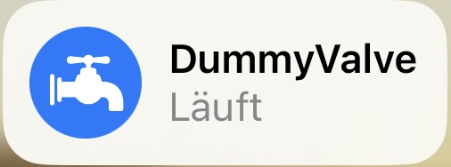
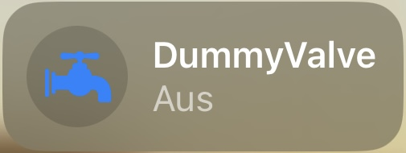
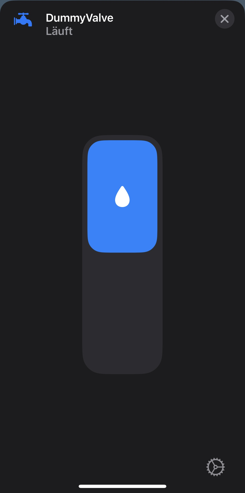
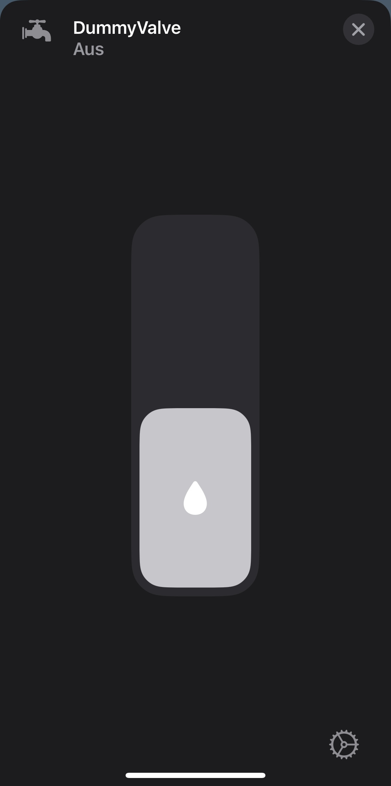

# homebridge-dummy-valve
Plugin to create stateful dummy valve/water faucet switches in homebridge. 

## Install
```javascript
sudo npm install -g homebridge-dummy-valve
```

## Configuration
```json
{
    "accessory": "DummyValve",
    "name": "WebShower"
}
```
- `accessory` **required**: must always be "DummyValve"
- `name` optional: displayname of your device (default: DummyValveSwitch)

## Images
<p align="center">
    <br><br>
    <br><br>
    <br><br>
    <br><br>
</p>